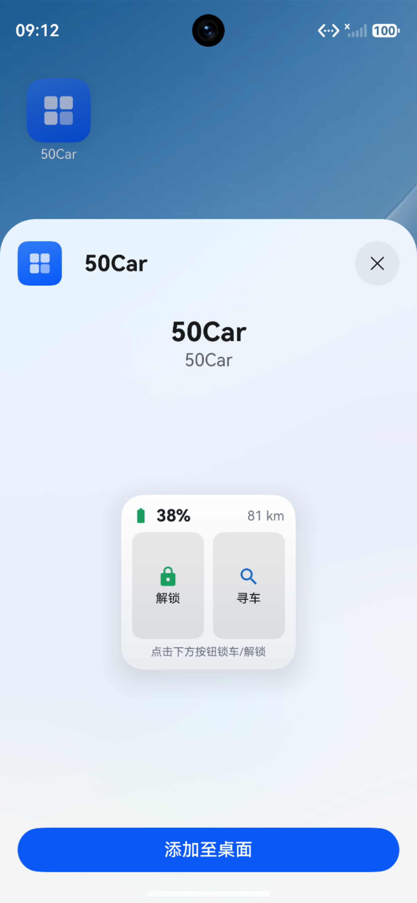

# 50car
五菱汽车车控 APP（原生鸿蒙版）

本项目是基于 [wulingthird](https://github.com/haocat/wulingthird) 移植的**原生鸿蒙（HarmonyOS NEXT）**应用，使用 ArkTS 重写，直接对接五菱官方车联网接口。

[wulingthird](https://github.com/haocat/wulingthird) 是基于 [hasscc/wuling](https://github.com/hasscc/wuling) 开发的五菱新能源独立开源车控 APP，无需 Home Assistant 环境，为五菱新能源车主提供一站式、全维度的车辆控制与状态监控体验。

> 版本说明：版本号采用日期命名（如 `26.8.30`），每次构建递增内部 versionCode。

## ✨ 核心功能

- 🔧 **远程车辆控制**：一键解锁/上锁、远程开启空调、开启尾箱、寻车鸣笛等快捷操作，指令下发后自动强制刷新车况
- 📊 **全维度状态监控**：实时查看电量 (SOC)、电池健康 (SOH)、剩余续航、总里程、昨日里程、平均能耗、电池/电机温度、低压电池、胎压等核心数据
- 🗺️ **车辆位置服务**：原生接入**高德地图鸿蒙星河版 3D SDK**，车辆定位经 WGS-84→GCJ-02 坐标校正，逆地理编码直接显示省市区详细地址；支持"车的位置/我的位置"快速聚焦、实时计算人车距离
- 🧭 **多导航应用寻车**：一键调起花瓣地图 / 高德 / 百度 / 腾讯 / 网页导航，自由选择寻车路线
- 🧩 **桌面服务卡片**：无需进入应用即可一键锁车/解锁、寻车，实时展示电量与续航，点击卡片直达应用
- 🌙 **深色模式**：全局自动跟随系统深浅色，地图底图同步切换夜间样式，切换免重启
- 📱 **沉浸式全面屏**：内容延伸至状态栏/导航栏，自动适配安全区
- 📜 **调试日志**：内置系统日志查看，支持导出、复制与查看服务器返回详情，便于排查问题
- ⚙️ **个性化配置**：API Token 快速绑定车辆，流程简洁

## 🚗 适配车型

- **核心适配**：五菱宏光 MINIEV 第三代马卡龙
- **兼容支持**：五菱新能源全系车型（基于五菱通用车联网接口，可自行测试适配）

## 🧰 运行环境

- **系统要求**：HarmonyOS NEXT（API 12 及以上，Stage 模式）
- **依赖 SDK**：高德地图鸿蒙版（`@amap/amap_lbs_common` / `map3d` / `location` / `search`）
- **地图 Key**：位置功能需自行到高德开放平台申请 **HarmonyOS 平台** Key 并在应用内配置（申请时绑定本应用 AppID）

## 📦 安装与使用

1. 从项目 Release 页面下载安装包（`.hap`）。暂不上架华为应用市场，安装可参考 [auto-installer](https://github.com/likuai2010/auto-installer)（基于开源 OpenHarmony 的 hdc 工具，简化开发调试体验）
2. 安装完成后，按指引配置 **API Token** 完成车辆绑定
3. API Token 需自行获取，建议使用已授权手机号获取
4. 如需地图与定位功能，在「位置」页配置高德地图 Key
5. 绑定成功后即可使用全部车控与监控功能
6. 蓝牙功能暂不可用

## ⚠️ 重要声明

1. 本项目为非官方第三方免费工具，仅用于个人学习与研究，禁止用于任何商业用途
2. 所有数据均直接与五菱官方车联网接口交互，不存储用户账号、车辆等任何敏感信息，使用过程中的所有风险由用户自行承担
3. 「五菱」为五菱汽车官方注册商标，本项目仅为工具类应用，与五菱汽车官方无任何隶属或合作关系

## 🤝 参与贡献

欢迎提交 Issue 反馈使用问题、提出功能优化建议，也欢迎提交 PR 共同完善项目、适配更多车型、优化用户体验。
