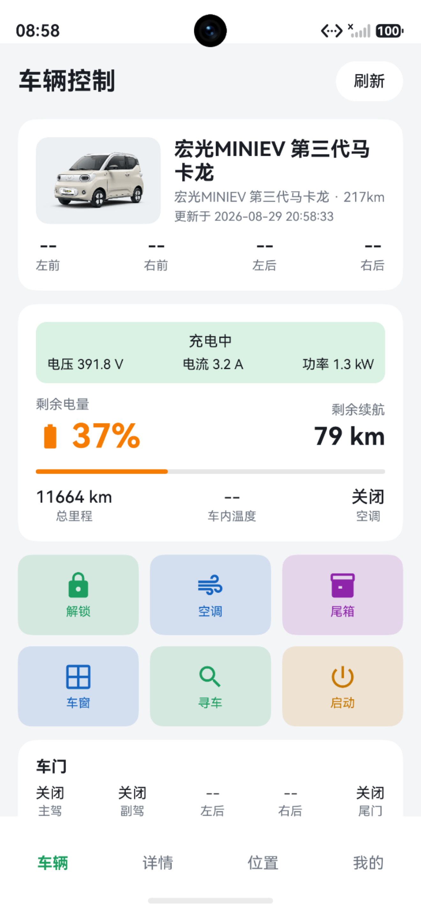

# 50car
五菱汽车车控 APP

本项目是基于 https://github.com/haocat/wulingthird 移植的原生鸿蒙应用 
wulingthird是基于 https://github.com/hasscc/wuling  开发的五菱新能源独立开源车控APP，无需Home Assistant环境，直接对接五菱官方车联网接口，为五菱新能源车主提供一站式、全维度的车辆控制与状态监控体验。
 
 
 
✨ 核心功能
 
- 🔧 远程车辆控制：支持一键解锁/上锁、远程开启空调、开启尾箱、寻车鸣笛等快捷操作，随时随地掌控车辆
- 📊 全维度状态监控：实时查看车辆电量(SOC)、电池健康(SOH)、剩余续航、总里程、昨日里程、平均能耗、电池温度、电机温度、低压电池状态等核心数据，全方位掌握车辆健康
- 🗺️ 车辆位置服务：集成花瓣地图，实时获取车辆精准定位，支持一键导航找车、位置分享，轻松找车、协同用车
- ⚙️ 个性化配置：支持API Token快速绑定、调试日志查看等功能，适配个性化使用习惯
 
 
🚗 适配车型
 
- 核心适配：五菱宏光MINIEV第三代马卡龙
- 兼容支持：五菱新能源全系车型（基于五菱通用车联网接口，可自行测试适配）
 
 
 
📦 安装与使用
 
1. 从项目Release页面下载安装包（Hap）暂时不考虑上架华为应用市场，安装参考https://github.com/likuai2010/auto-installer（Auto-Installer是基于开源OpenHarmony项目的Hdc工具。该项目致力于为简化开发调试体验。我们正在积极开发中，以满足鸿蒙开发者随时调试应用需求。）
2. 安装完成后，按照指引配置API Token，完成车辆绑定
3. API Token自行获取
4. 绑定成功后，即可使用全部车控与监控功能
5. 建议用授权的手机号获取token
6. 蓝牙功能暂不可用
 
 
⚠️ 重要声明
 
1. 本项目为非官方第三方免费工具，仅用于个人学习与研究，禁止用于任何商业用途
2. 本项目所有数据均直接与五菱官方车联网接口交互，不存储用户账号、车辆等任何敏感信息，使用过程中的所有风险由用户自行承担
3. 「五菱」为五菱汽车官方注册商标，本项目仅为工具类应用，与五菱汽车官方无任何隶属或合作关系
 
 
 
🤝 参与贡献
 
欢迎提交Issue反馈使用问题、提出功能优化建议，也欢迎提交PR共同完善项目、适配更多车型、优化用户体验。
 
 
